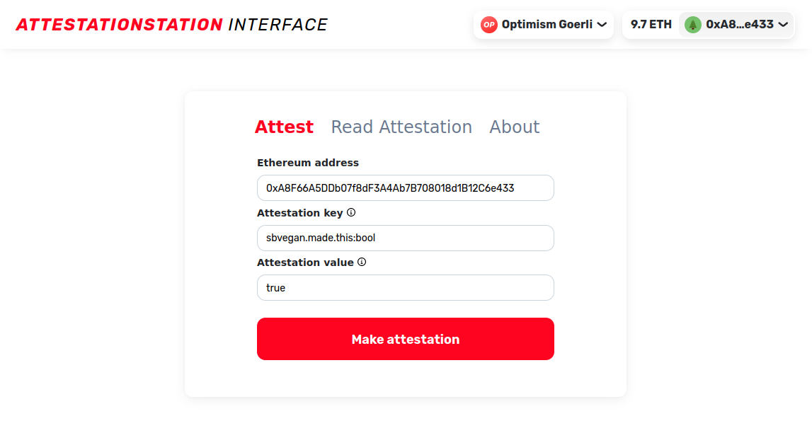

# Attestation Station Interface

**_NOTE: this is only available on Optimism Goerli. The mainnet contracts will be launched soon._**

An open source interface for Optimism's AttestationStation -- a data primative for making arbitrary attestations about Ethereum addresses -- [OPLab's Official Documentation](https://community.optimism.io/docs/governance/attestation-station/#).



## Key Features

- Make attestations to Optimism's AttestationStation
- Read raw hex and string formatted attestation values

## Run Locally

```
yarn
yarn start
```

### Tests...?

```
uhhh... click around? fafo?
```

## License

MIT

## Acknowledgements

Thank you Zain and the OPLabs ecosystem team for giving me an inside peak at what y'all are cooking up! I'm excited for the Optimistic vision, how it echos a cypher/solar punk future, and how I can help make it a reality.
